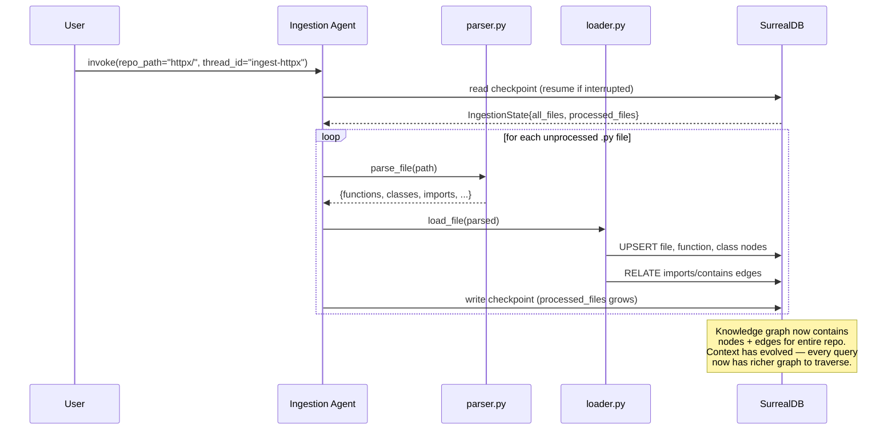
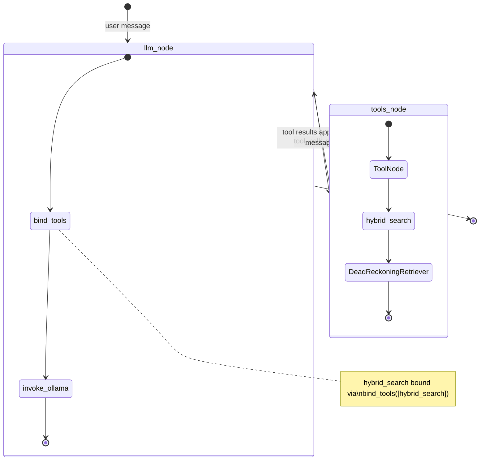
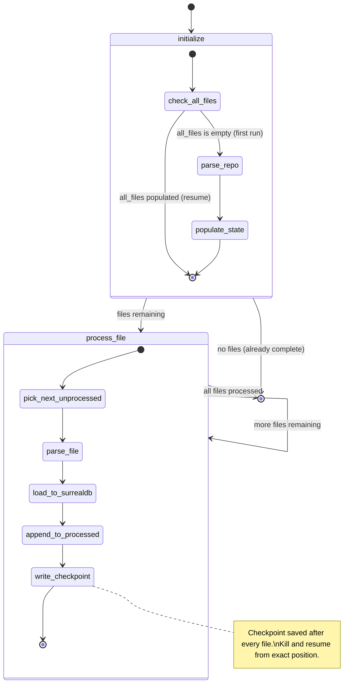
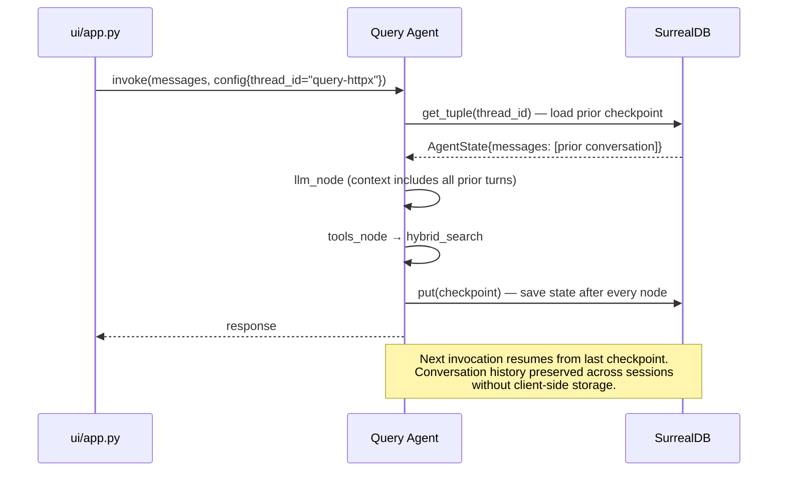

# Architecture

This document covers: system overview, SurrealDB schema and usage, LangGraph agent design, integration points, and design decisions.

---

## System Overview

```mermaid
flowchart TD
    User([User / Streamlit UI]) -->|natural language query| QA[Query Agent\nlangraph StateGraph]
    User -->|repo path| IA[Ingestion Agent\nlangraph StateGraph]

    IA -->|parse .py files| Parser[ingestion/parser.py\nPython ast module]
    Parser -->|entities dict| Loader[ingestion/loader.py\nupsert + RELATE]
    Loader -->|nodes + edges| SDB[(SurrealDB Cloud\nhackathon::deadreckoning)]

    QA -->|hybrid_search tool| Tools[agent/tools.py\nDeadReckoningRetriever]
    Tools -->|SurrealQL graph + vector queries| SDB
    Tools -->|ranked results| QA

    QA -->|checkpoint read/write| SDB
    IA -->|checkpoint read/write| SDB

    QA -->|LangSmith traces| LS[LangSmith\nObservability]
    Tools -->|@traceable spans| LS

    SDB -->|graph data for visualisation| UI[ui/app.py\nStreamlit + streamlit-agraph]
    QA -->|chat responses| UI
```

---

## SurrealDB: Detailed Architecture

SurrealDB serves two distinct roles in this system: **knowledge graph store** and **agent checkpoint store**. Both live in the same database instance (`hackathon::deadreckoning`), demonstrating SurrealDB's hybrid relational/graph/document capabilities.

```mermaid
erDiagram
    file {
        string id PK "file:md5hash"
        string path "relative path e.g. auth/login.py"
        string language "python"
        int line_count
        array embedding "optional, future use"
    }
    function {
        string id PK "function:md5hash"
        string name
        record file FK
        int lineno
        string docstring "optional"
        array embedding "768-dim nomic-embed-text vector"
        bool is_method
        string class_name "optional"
        bool has_docstring
    }
    class {
        string id PK "class:md5hash"
        string name
        record file FK
        int lineno
        array bases "base class name strings"
    }
    checkpoint {
        string id PK
        string thread_id
        string checkpoint_ns
        string checkpoint_id
        object metadata
        object checkpoint
    }
    write {
        string id PK
        string thread_id
        string task_id
        object writes
    }

    file ||--o{ function : "contains (edge)"
    file ||--o{ class : "contains (edge)"
    file ||--o{ file : "imports (edge)"
    function ||--o{ function : "calls (edge)"
    class ||--o{ class : "inherits (edge)"
    checkpoint ||--o{ write : "has writes"
```

### SurrealDB Namespace + Database

```
namespace: hackathon
database:  deadreckoning
```

### Node Tables

```sql
-- FILE: a .py source file
DEFINE TABLE file SCHEMAFULL;
  DEFINE FIELD path       ON file TYPE string;
  DEFINE FIELD language   ON file TYPE string DEFAULT 'python';
  DEFINE FIELD line_count ON file TYPE int;
  DEFINE FIELD embedding  ON file TYPE option<array>;

DEFINE INDEX file_path_idx ON file FIELDS path UNIQUE;

-- FUNCTION: a named function or method
DEFINE TABLE function SCHEMAFULL;
  DEFINE FIELD name          ON function TYPE string;
  DEFINE FIELD file          ON function TYPE record<file>;
  DEFINE FIELD lineno        ON function TYPE int;
  DEFINE FIELD docstring     ON function TYPE option<string>;
  DEFINE FIELD embedding     ON function TYPE option<array>;  -- 768-dim vector
  DEFINE FIELD is_method     ON function TYPE bool DEFAULT false;
  DEFINE FIELD class_name    ON function TYPE option<string>;
  DEFINE FIELD has_docstring ON function TYPE bool DEFAULT false;

DEFINE INDEX fn_name_file_idx ON function FIELDS name, file UNIQUE;

-- CLASS: a class definition
DEFINE TABLE class SCHEMAFULL;
  DEFINE FIELD name   ON class TYPE string;
  DEFINE FIELD file   ON class TYPE record<file>;
  DEFINE FIELD lineno ON class TYPE int;
  DEFINE FIELD bases  ON class TYPE array DEFAULT [];

DEFINE INDEX class_name_file_idx ON class FIELDS name, file UNIQUE;
```

### Edge Tables (Graph Relationships)

```sql
DEFINE TABLE imports   SCHEMALESS;  -- file -> file
DEFINE TABLE contains  SCHEMALESS;  -- file -> function | class
DEFINE TABLE calls     SCHEMALESS;  -- function -> function
DEFINE TABLE inherits  SCHEMALESS;  -- class -> class
```

### Checkpoint Tables (Agent State Persistence)

```sql
DEFINE TABLE IF NOT EXISTS checkpoint SCHEMALESS;  -- full agent state snapshots
DEFINE TABLE IF NOT EXISTS `write`    SCHEMALESS;  -- per-task write deltas
```

### Deterministic Record IDs (Idempotent Ingestion)

```python
# Hash-based IDs mean re-ingestion updates records rather than duplicating
file_id     = f"file:`{md5(path)[:12]}`"
function_id = f"function:`{md5(path + '::' + name)[:12]}`"
class_id    = f"class:`{md5(path + '::' + name)[:12]}`"
```

### Key SurrealQL Query Patterns

```sql
-- Upsert (idempotent ingestion)
INSERT INTO file { id: file:`abc123`, path: "auth.py", language: "python", line_count: 120 }
  ON DUPLICATE KEY UPDATE line_count = line_count;

-- Create a graph edge
RELATE file:`abc123` -> imports -> file:`def456`;

-- Forward graph traversal: what does auth.py import?
SELECT ->imports->file.path AS imports FROM file:`abc123`;

-- Reverse traversal: what imports utils.py?
SELECT <-imports<-file.path AS imported_by FROM file:`def456`;

-- Find parent class by proximity (lineno ordering)
SELECT name, bases, lineno FROM `class`
WHERE file.path = $path AND lineno < $lineno
ORDER BY lineno DESC LIMIT 1;

-- Sibling methods in same class
SELECT name FROM `function`
WHERE file.path = $path AND class_name = $class_name AND name != $name
LIMIT 20;

-- Vector similarity search (semantic retrieval)
SELECT id, name, lineno, class_name, docstring, file.path AS path,
       vector::similarity::cosine(embedding, $vec) AS score
FROM `function`
WHERE embedding IS NOT NONE
  AND vector::similarity::cosine(embedding, $vec) >= $threshold
ORDER BY score DESC LIMIT 10;

-- Keyword match (graph name search)
SELECT id, name, lineno, class_name, docstring, file.path AS path
FROM `function`
WHERE string::lowercase(name) CONTAINS $term
LIMIT 25;
```

### How Context Evolves During Execution



---

## LangGraph / LangChain: Detailed Architecture

### Query Agent Graph



### Ingestion Agent Graph



### Agent State Schemas

```python
# Query agent — conversational state
class AgentState(TypedDict):
    messages: Annotated[list, add_messages]  # full conversation history
    repo_path: str                            # which repo is loaded

# Ingestion agent — progress tracking state
class IngestionState(TypedDict):
    messages: Annotated[list, add_messages]
    repo_path: str
    all_files:       list[str]  # all .py files discovered on first run
    processed_files: list[str]  # grows with each checkpoint
    current_file:    str        # last file processed
```

### hybrid_search: Retrieval Pipeline

The sole tool exposed to the query agent. Combines semantic vector search and keyword graph search via Reciprocal Rank Fusion (RRF), then enriches results with graph context.

```mermaid
flowchart TD
    Q[User query string] --> EX[_extract_terms\nCamelCase split + stopword filter]
    Q --> EMB[OllamaEmbeddings\nnomic-embed-text 768-dim]

    EX -->|keyword terms| KW[_keyword\nSurrealQL: name CONTAINS term]
    EMB -->|embedding vector| SEM[_semantic\nSurrealQL: vector::similarity::cosine >= threshold]

    KW -->|ranked list| RRF[_rrf_merge\nReciprocal Rank Fusion\nscore = Σ 1/(k + rank)\nexact-name bonus: +1/k]
    SEM -->|ranked list| RRF

    RRF -->|top N docs| ENR[_enrich x N in parallel\nasyncio.gather]

    ENR -->|doc + path + lineno| PC["SurrealQL: parent class\n(lineno proximity ordering)"]
    ENR -->|doc + class_name| SB["SurrealQL: sibling methods\n(same file + class_name)"]

    PC --> FMT[_format]
    SB --> FMT
    FMT -->|structured text blocks| LLM[LLM context window]
```

### LangSmith Observability

Every retrieval sub-step is decorated with `@traceable`, producing a nested trace tree in LangSmith:

```
LangGraph run
└── llm_node
└── tools_node
    └── hybrid_search
        ├── semantic_search     [retriever] vec_dims=768, threshold=0.55
        ├── keyword_search      [retriever] terms=[...]
        ├── rrf_merge           [chain]     list_counts=[N, M]
        └── graph_enrich x N   [retriever] function, parent_class, siblings
```

### Checkpointing: How Resumable Flows Work



### Thread ID Namespacing

```python
# Ingestion and query use separate thread namespaces
# to prevent state deserialization conflicts
ingest_config = {"configurable": {"thread_id": f"ingest-{repo_name}"}}
query_config  = {"configurable": {"thread_id": f"query-{repo_name}"}}

# Both share the same SurrealDB database
# but have completely separate checkpoint histories
```

### LLM Wiring

```python
# Model selected at runtime via env var — no code changes to switch
llm = ChatOllama(
    model=os.getenv("OLLAMA_MODEL", "llama3.2:3b"),  # swap for gemma3:27b at demo
    base_url=os.getenv("OLLAMA_BASE_URL", "http://localhost:11434"),
)
llm_with_tools = llm.bind_tools([hybrid_search])

# Embeddings — 768-dim vectors stored in SurrealDB function.embedding
embedder = OllamaEmbeddings(model="nomic-embed-text")
```

---

## Integration Points

The five boundaries where things break. Each must be verified independently before wiring together.

| ID | Boundary | Test command | Success signal |
|---|---|---|---|
| INT-1 | parser.py → loader.py | `parse_file('sample.py')` | dict with `functions`, `imports` keys |
| INT-2 | loader.py → SurrealDB | `load_file(parsed)` then `SELECT count() FROM function GROUP ALL` | count > 0 |
| INT-3 | tools.py → SurrealDB | `hybrid_search.invoke({'query': 'authenticate user'})` | non-empty list |
| INT-4 | graph.py + checkpointer | kill ingestion mid-run, resume same thread_id | resumes from file N+1, not file 1 |
| INT-5 | agent → Streamlit UI | chat "what does _client.py import?", check LangSmith | real file names in response, trace visible |

---

## Design Decisions

**Why SurrealDB for both knowledge graph AND checkpoints?**
SurrealDB handles graph-style data (RELATE, traversal) and row-style data (checkpoint tables) in the same instance. This avoids a second database and demonstrates SurrealDB doing two qualitatively different things — knowledge graph queries and transactional agent state — which directly addresses both SurrealDB judging criteria (structured memory + persistent agent state).

**Why hybrid search (RRF) instead of pure vector search?**
Codebases have exact names (function names, class names) that benefit from keyword matching, and semantic concepts (what does authentication do?) that benefit from vector similarity. RRF merges both ranked lists without needing to tune a weighting parameter. The exact-name bonus ensures that searching "DigestAuth" finds `DigestAuth` even if semantic similarity is low.

**Why graph enrichment after retrieval?**
The LLM needs context beyond just a docstring — which class a function belongs to and what sibling methods exist gives the model enough structure to reason about code architecture. This context comes from SurrealDB graph queries (lineno-ordered class proximity, shared class_name siblings), not embeddings.

**Why Python `ast` module over tree-sitter?**
Built-in, zero install friction, handles all valid Python 3 syntax. tree-sitter adds multi-language support at the cost of a C dependency and more complex setup. Python-only scope for the hackathon.

**Why Streamlit over FastAPI + React?**
Solo build. Streamlit with `streamlit-agraph` delivers graph visualisation and chat in ~200 lines. The demo needs to look credible, not beautiful.

**Why separate thread IDs for ingestion vs query agents?**
Ingestion and query are separate LangGraph graphs with different state schemas (`IngestionState` vs `AgentState`). Mixing their checkpoints in the same thread causes state deserialization errors. Namespacing thread IDs (`ingest-*` vs `query-*`) keeps them cleanly separated in the same SurrealDB database.
