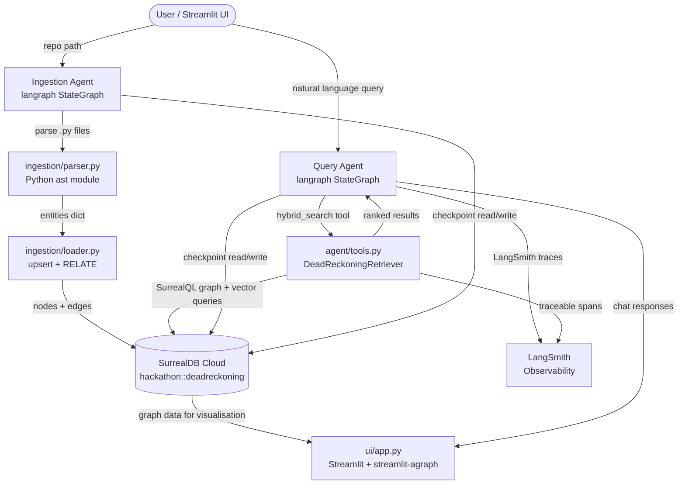
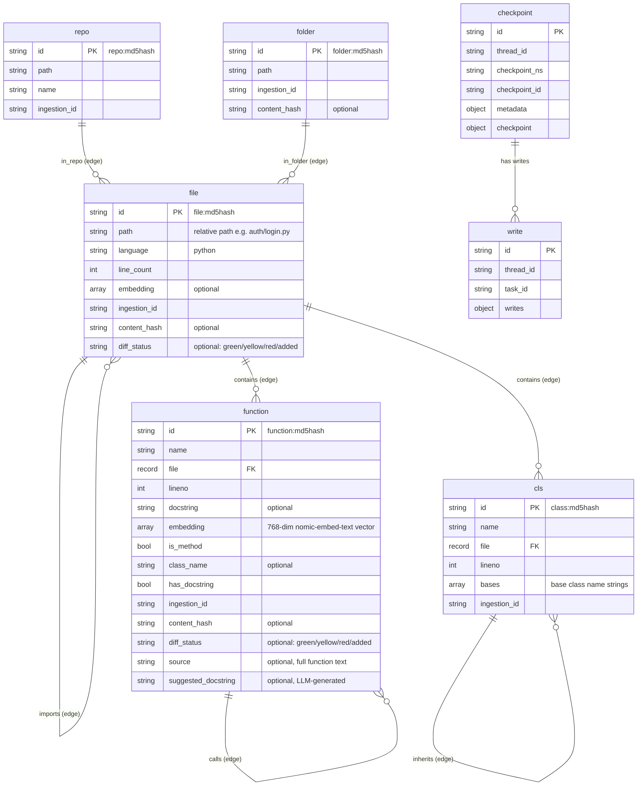
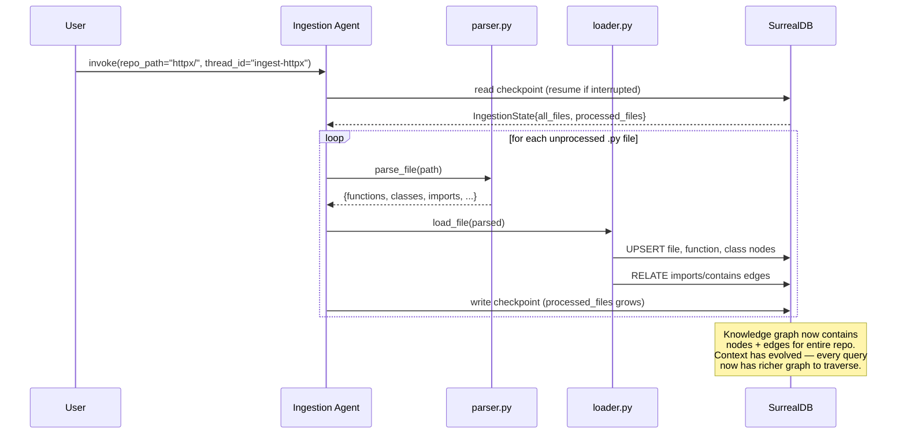
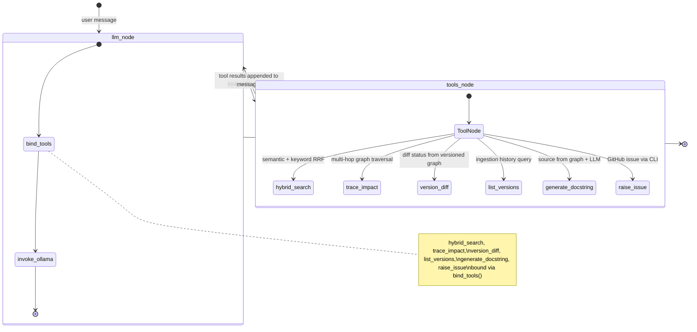
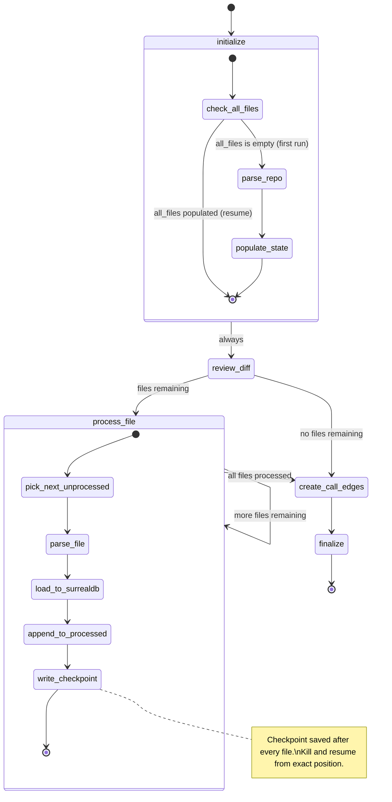
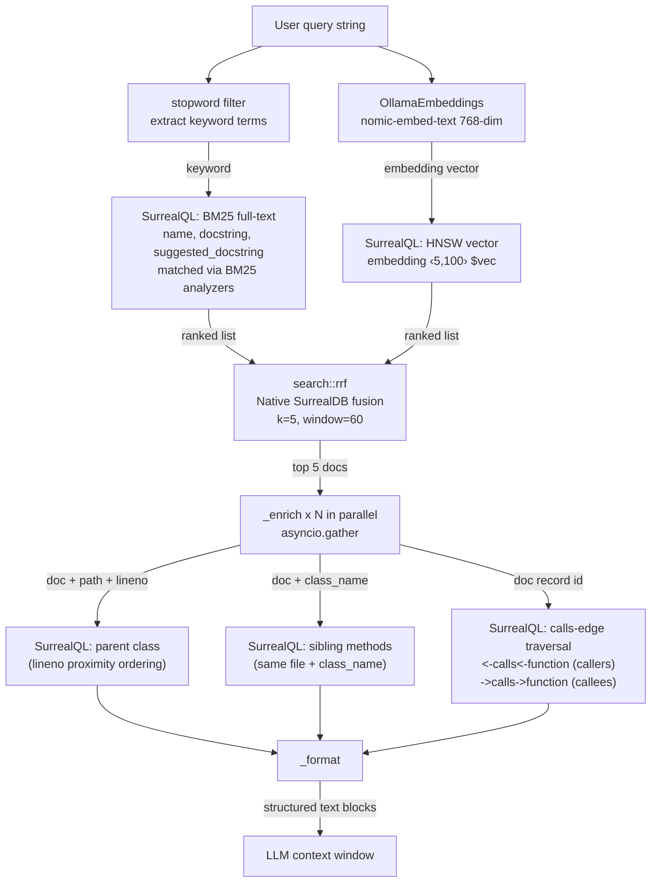
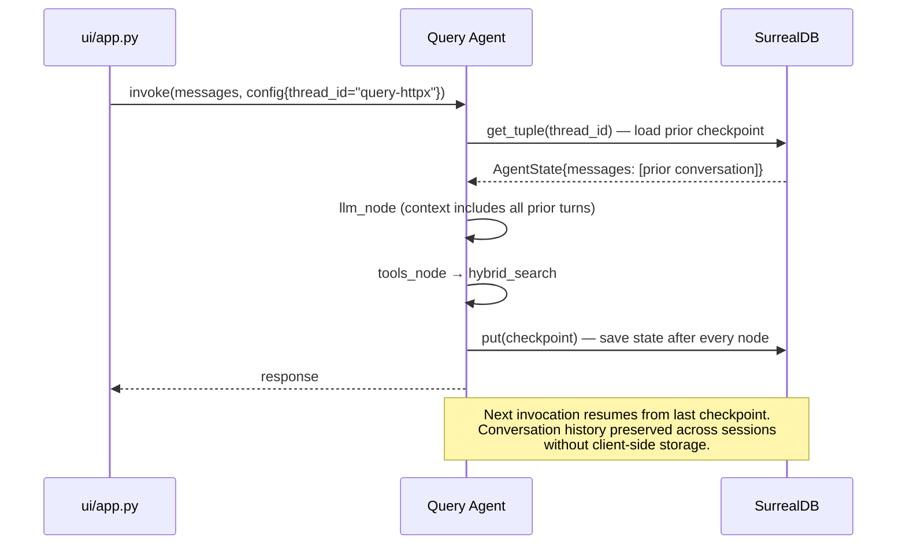

# Architecture

This document covers: system overview, SurrealDB schema and usage, LangGraph agent design, integration points, and design decisions.

---

## System Overview



---

## SurrealDB: Detailed Architecture

SurrealDB serves two distinct roles in this system: **knowledge graph store** and **agent checkpoint store**. Both live in the same database instance (`hackathon::deadreckoning`), demonstrating SurrealDB's hybrid relational/graph/document capabilities.



### SurrealDB Namespace + Database

```
namespace: hackathon
database:  deadreckoning
```

### Ingestion Table

```sql
-- INGESTION: tracks each repo ingestion run
DEFINE TABLE ingestion SCHEMAFULL;
  DEFINE FIELD repo_path    ON ingestion TYPE string;
  DEFINE FIELD repo_name    ON ingestion TYPE string;
  DEFINE FIELD github_url   ON ingestion TYPE option<string>;
  DEFINE FIELD ingested_at  ON ingestion TYPE datetime;
  DEFINE FIELD status       ON ingestion TYPE string DEFAULT 'pending';
  DEFINE FIELD content_hash ON ingestion TYPE option<string>;
  DEFINE FIELD file_count   ON ingestion TYPE option<int>;
  DEFINE FIELD snapshot_path ON ingestion TYPE option<string>;
```

The `ingestion` table is central to version awareness — it records every ingestion run with timestamps, file counts, and snapshot paths. The `list_versions` tool queries it directly, and `version_diff` uses it to auto-detect which versions are being compared.

### Node Tables

```sql
-- REPO: represents the root of an indexed repository
DEFINE TABLE repo SCHEMAFULL;
  DEFINE FIELD path         ON repo TYPE string;
  DEFINE FIELD name         ON repo TYPE string;
  DEFINE FIELD ingestion_id ON repo TYPE string;

DEFINE INDEX repo_path_iid_idx ON repo FIELDS path, ingestion_id UNIQUE;

-- FOLDER: represents a directory containing .py files
DEFINE TABLE folder SCHEMAFULL;
  DEFINE FIELD path         ON folder TYPE string;
  DEFINE FIELD ingestion_id ON folder TYPE string;
  DEFINE FIELD content_hash ON folder TYPE option<string>;

DEFINE INDEX folder_path_iid_idx ON folder FIELDS path, ingestion_id UNIQUE;

-- FILE: a .py source file
DEFINE TABLE file SCHEMAFULL;
  DEFINE FIELD path         ON file TYPE string;
  DEFINE FIELD language     ON file TYPE string DEFAULT 'python';
  DEFINE FIELD line_count   ON file TYPE int;
  DEFINE FIELD embedding    ON file TYPE option<array>;
  DEFINE FIELD ingestion_id ON file TYPE string;
  DEFINE FIELD content_hash ON file TYPE option<string>;
  DEFINE FIELD diff_status  ON file TYPE option<string>;

DEFINE INDEX file_path_iid_idx ON file FIELDS path, ingestion_id UNIQUE;

-- FUNCTION: a named function or method
DEFINE TABLE function SCHEMAFULL;
  DEFINE FIELD name                ON function TYPE string;
  DEFINE FIELD file                ON function TYPE record<file>;
  DEFINE FIELD lineno              ON function TYPE int;
  DEFINE FIELD docstring           ON function TYPE option<string>;
  DEFINE FIELD has_docstring       ON function TYPE bool DEFAULT false;
  DEFINE FIELD class_name          ON function TYPE option<string>;
  DEFINE FIELD is_method           ON function TYPE bool DEFAULT false;
  DEFINE FIELD embedding           ON function TYPE option<array>;  -- 768-dim vector
  DEFINE FIELD ingestion_id        ON function TYPE string;
  DEFINE FIELD content_hash        ON function TYPE option<string>;
  DEFINE FIELD diff_status         ON function TYPE option<string>;
  DEFINE FIELD source              ON function TYPE option<string>;
  DEFINE FIELD suggested_docstring ON function TYPE option<string>;

DEFINE INDEX fn_name_file_class_iid_idx ON function FIELDS name, file, class_name, ingestion_id UNIQUE;

-- CLASS: a class definition
DEFINE TABLE class SCHEMAFULL;
  DEFINE FIELD name          ON class TYPE string;
  DEFINE FIELD file          ON class TYPE record<file>;
  DEFINE FIELD lineno        ON class TYPE int;
  DEFINE FIELD bases         ON class TYPE array DEFAULT [];
  DEFINE FIELD ingestion_id  ON class TYPE string;

DEFINE INDEX class_name_file_iid_idx ON class FIELDS name, file, ingestion_id UNIQUE;
```

### Edge Tables (Graph Relationships)

```sql
DEFINE TABLE imports   SCHEMALESS;  -- file -> file
DEFINE TABLE contains  SCHEMALESS;  -- file -> function | class
DEFINE TABLE calls     SCHEMALESS;  -- function -> function
DEFINE TABLE inherits  SCHEMALESS;  -- class -> class
DEFINE TABLE in_folder SCHEMALESS;  -- file -> folder
DEFINE TABLE in_repo   SCHEMALESS;  -- file -> repo
```

### Checkpoint Tables (Agent State Persistence)

```sql
DEFINE TABLE IF NOT EXISTS checkpoint SCHEMALESS;  -- full agent state snapshots
DEFINE TABLE IF NOT EXISTS `write`    SCHEMALESS;  -- per-task write deltas
```

### Deterministic Record IDs (Idempotent Ingestion)

```python
# Hash-based IDs include ingestion_id — each version gets its own nodes
file_id     = f"file:`{md5(path + ingestion_id)[:12]}`"
function_id = f"function:`{md5(path + '::' + class_name + '::' + name + '::' + ingestion_id)[:12]}`"
class_id    = f"class:`{md5(path + '::' + name + '::' + ingestion_id)[:12]}`"
```

### Key SurrealQL Query Patterns

```sql
-- List ingested versions (list_versions tool)
SELECT repo_path, repo_name, github_url, ingested_at, status, file_count, snapshot_path
FROM ingestion ORDER BY ingested_at DESC;

-- Upsert (idempotent ingestion)
UPSERT type::record('file', $id) SET
  path = $path, line_count = $lc, language = 'python',
  ingestion_id = $iid, content_hash = $ch;

-- Create a graph edge (idempotent via ON DUPLICATE KEY)
INSERT RELATION INTO contains {
  id: type::record('contains', $eid),
  in: type::record('file', $fid),
  out: type::record('function', $fnid)
} ON DUPLICATE KEY UPDATE in = in;

-- Forward graph traversal: what does a file contain?
SELECT ->contains->`function`.name AS functions FROM file WHERE path CONTAINS $path;

-- Reverse traversal: what imports utils.py?
SELECT <-imports<-file.path AS imported_by FROM file WHERE path CONTAINS 'utils';

-- Multi-hop graph traversal: direct + transitive callers (trace_impact tool)
SELECT name, file.path AS path,
       <-calls<-`function`.name AS direct_callers,
       <-calls<-`function`<-calls<-`function`.name AS transitive_callers
FROM `function` WHERE name CONTAINS $symbol;

-- Hybrid search with native RRF (hybrid_search tool)
LET $vs = SELECT *, file.path AS path,
                    vector::similarity::cosine(embedding, $vec) AS score
          FROM `function` WHERE embedding <|5,100|> $vec;
LET $ft = SELECT *, file.path AS path,
                    search::score(0) + search::score(1) + search::score(2) AS score
          FROM `function`
          WHERE name @0@ $keyword OR docstring @1@ $keyword
                OR suggested_docstring @2@ $keyword
          ORDER BY score DESC LIMIT 10;
RETURN search::rrf([$vs, $ft], 5, 60);

-- Find parent class by proximity (lineno ordering)
SELECT name, bases, lineno FROM `class`
WHERE file.path = $path AND lineno < $lineno
ORDER BY lineno DESC LIMIT 1;

-- Sibling methods in same class
SELECT name FROM `function`
WHERE file.path = $path AND class_name = $class_name AND name != $name
LIMIT 20;

-- Calls-edge neighbourhood for a hybrid_search result (enrichment)
SELECT
  <-calls<-`function`.name      AS callers,
  <-calls<-`function`.file.path AS caller_files,
  ->calls->`function`.name      AS callees
FROM $fn_id;

-- Version diff: files with diff status (version_diff tool)
SELECT path, diff_status, ->contains->`function`.name AS functions
FROM file WHERE diff_status IS NOT NONE ORDER BY diff_status;
```

### How Context Evolves During Execution



---

## LangGraph / LangChain: Detailed Architecture

### Query Agent Graph



### Ingestion Agent Graph



### Agent State Schemas

```python
# Query agent — conversational state
class AgentState(TypedDict):
    messages: Annotated[list, add_messages]  # full conversation history
    repo_path: str                            # which repo is loaded

# Ingestion agent — progress tracking state
class IngestionState(TypedDict):
    messages: Annotated[list, add_messages]
    repo_path: str          # canonical identifier stored in DB (URL or local path)
    disk_path: str          # actual filesystem path used for parsing
    ingestion_id: str       # SurrealDB ingestion record ID
    prev_ingestion_id: str  # empty string for fresh ingests
    all_files:       list[str]  # all .py files discovered on first run
    processed_files: list[str]  # grows with each checkpoint
    current_file:    str        # last file processed
```

### Agent Tools

Six tools are exposed to the query agent:

1. **hybrid_search** — Combines HNSW vector similarity and BM25 full-text matching via SurrealDB's native `search::rrf()` in a single SurrealQL query. Results are enriched with parent class, sibling functions, and immediate `calls`-edge neighbourhood (callers + callees) in parallel.
2. **trace_impact** — Multi-hop graph traversal (`<-calls<-function<-calls<-function`) finding direct and transitive callers of any function. Two hops through the calls graph in one query.
3. **version_diff** — Auto-detects versions from the `ingestion` table, then reads `diff_status` (green/yellow/red) from the versioned knowledge graph at both file and function granularity. Flags undocumented functions.
4. **list_versions** — Queries the `ingestion` table to show all indexed repositories, their versions, file counts, timestamps, and snapshot status. Lightweight — useful for "what's been ingested?" without triggering a full diff.
5. **generate_docstring** — Reads a function's source code from the knowledge graph and sends it to the LLM to generate a Python docstring. Chains naturally after `version_diff` flags undocumented functions.
6. **raise_issue** — Creates a GitHub issue via the `gh` CLI with a code improvement suggestion. Chains after `generate_docstring` to complete the agentic code review loop: discover → fix → act.



### LangSmith Observability

Each top-level tool is wrapped in a LangSmith `@traceable` decorator, and LangChain's Ollama / SurrealDB integrations contribute automatic child spans. The resulting trace tree looks roughly like:

```
LangGraph run
└── llm_node
└── tools_node
    ├── hybrid_search      [retriever] native RRF (vector + BM25) + graph enrichment
    ├── trace_impact       [retriever] multi-hop calls graph traversal
    ├── version_diff       [retriever] diff_status from versioned graph + ingestion auto-detect
    ├── list_versions      [retriever] ingestion history from SurrealDB
    ├── generate_docstring [chain]     source from graph → LLM → docstring
    └── raise_issue        [tool]      gh issue create via CLI
```

### Checkpointing: How Resumable Flows Work



### Thread ID Namespacing

```python
# Ingestion and query use separate thread namespaces
# to prevent state deserialization conflicts
ingest_config = {"configurable": {"thread_id": f"ingest-{repo_name}"}}
query_config  = {"configurable": {"thread_id": f"query-{repo_name}"}}

# Both share the same SurrealDB database
# but have completely separate checkpoint histories
```

### LLM Wiring

```python
# Model selected at runtime via env var — no code changes to switch
llm = ChatOllama(
    model=os.getenv("OLLAMA_MODEL", "gemma4:e2b"),  # gpt-oss:20b as heavier fallback
    base_url=os.getenv("OLLAMA_BASE_URL", "http://localhost:11434"),
)
llm_with_tools = llm.bind_tools([
    hybrid_search, trace_impact, version_diff,
    list_versions, generate_docstring, raise_issue
])

# Embeddings — 768-dim vectors stored in SurrealDB function.embedding
embedder = OllamaEmbeddings(model="nomic-embed-text")
```

---

## Integration Points

The five boundaries where things break. Each must be verified independently before wiring together.

| ID | Boundary | Test command | Success signal |
|---|---|---|---|
| INT-1 | parser.py → loader.py | `parse_file('sample.py')` | dict with `functions`, `imports` keys |
| INT-2 | loader.py → SurrealDB | `load_file(parsed)` then `SELECT count() FROM function GROUP ALL` | count > 0 |
| INT-3 | tools.py → SurrealDB | `hybrid_search.invoke({'query': 'authenticate user'})` | non-empty list |
| INT-4 | graph.py + checkpointer | kill ingestion mid-run, resume same thread_id | resumes from file N+1, not file 1 |
| INT-5 | agent → Streamlit UI | chat "what does _client.py import?", check LangSmith | real file names in response, trace visible |

---

## Design Decisions

**Why SurrealDB for both knowledge graph AND checkpoints?**
SurrealDB handles graph-style data (RELATE, traversal) and row-style data (checkpoint tables) in the same instance. This avoids a second database and demonstrates SurrealDB doing two qualitatively different things — knowledge graph queries and transactional agent state — which directly addresses both SurrealDB judging criteria (structured memory + persistent agent state).

**Why hybrid search (RRF) instead of pure vector search?**
Codebases have exact names (function names, class names) that benefit from keyword matching, and semantic concepts (what does authentication do?) that benefit from vector similarity. RRF merges both ranked lists without needing to tune a weighting parameter. To make identifier queries like "DigestAuth" survive, the keyword extraction step splits camelCase/PascalCase tokens before BM25 runs, so `DigestAuth` is searched as the constituent parts `Digest`/`Auth` in addition to the literal string.

**Why graph enrichment after retrieval?**
The LLM needs context beyond just a docstring — which class a function belongs to and what sibling methods exist gives the model enough structure to reason about code architecture. This context comes from SurrealDB graph queries (lineno-ordered class proximity, shared class_name siblings), not embeddings.

**Why Python `ast` module over tree-sitter?**
Built-in, zero install friction, handles all valid Python 3 syntax. tree-sitter adds multi-language support at the cost of a C dependency and more complex setup. Python-only scope for the hackathon.

**Why Streamlit over FastAPI + React?**
Solo build. Streamlit with `streamlit-agraph` delivers graph visualisation and chat in ~200 lines. The demo needs to look credible, not beautiful.

**Why separate thread IDs for ingestion vs query agents?**
Ingestion and query are separate LangGraph graphs with different state schemas (`IngestionState` vs `AgentState`). Mixing their checkpoints in the same thread causes state deserialization errors. Namespacing thread IDs (`ingest-*` vs `query-*`) keeps them cleanly separated in the same SurrealDB database.
