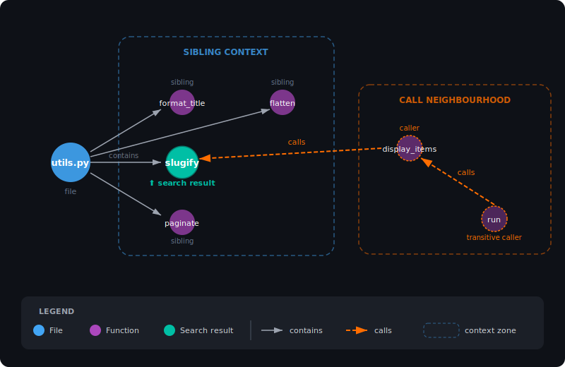
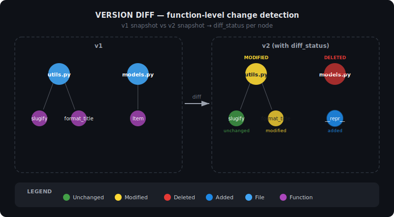

# DeadReckoning

[](https://python.org)
[](https://surrealdb.com)
[](https://langchain-ai.github.io/langgraph/)
[](https://smith.langchain.com)
[](https://ollama.com)
[](LICENSE)

> Navigate any codebase. Dead reckoning — finding your way through unknown territory.

<p align="center">
  
</p>

`dead-reckoning` parses any Python codebase into a **SurrealDB knowledge graph** — files, functions, classes, imports, and call relationships all become queryable nodes and edges. A **LangGraph agent** with six specialised tools navigates the graph to answer architecture questions in plain English. Every tool call, graph traversal, and reasoning step is traced in **LangSmith**. Ingestion is **checkpointed** — kill it mid-run, restart, and it resumes exactly where it stopped.

Built at the LangChain x SurrealDB London Hackathon, March 2026.

---

## What it does

1. **Ingest** — point it at a Python repo (local path or GitHub URL), it walks every `.py` file and builds a knowledge graph in SurrealDB
2. **Persist** — ingestion checkpoints after every file using `langgraph-checkpoint-surrealdb`; crash-safe and resumable
3. **Version** — ingest a second version and the graph diffs itself: green/yellow/red at file AND function granularity
4. **Query** — a LangGraph agent with six tools answers questions about the codebase
5. **Visualise** — Streamlit UI shows the live graph (with diff colours) and a chat interface

### The three pillars

| Pillar | Role | How it's used |
|---|---|---|
| **SurrealDB** | Multi-model database | Knowledge graph (nodes + edges), vector search (HNSW), full-text search (BM25), native RRF fusion, agent checkpoint state, ingestion history, version snapshots — all in one instance |
| **LangGraph** | Agent orchestration | Stateful agent loop with conditional tool routing, resumable ingestion pipeline with per-file checkpoints, thread-based conversation persistence |
| **LangSmith** | Observability | Every agent step traced — tool calls, graph traversals, multi-tool reasoning chains all visible as nested spans |

---

## Agent tools

The query agent has six tools, each showcasing different SurrealDB capabilities:

| Tool | What it does | SurrealDB feature |
|---|---|---|
| **hybrid_search** | Find functions by concept or name | `search::rrf()` fuses HNSW vector + BM25 keyword in one query, graph enrichment adds parent class + siblings |
| **trace_impact** | Map blast radius of a change | Multi-hop graph traversal (`<-calls<-function<-calls<-function`) — 2 hops in one SurrealQL query |
| **version_diff** | Show what changed between versions | Reads `diff_status` from versioned graph, auto-detects latest versions from `ingestion` table |
| **list_versions** | Show ingestion history | Queries `ingestion` table — what repos are indexed, how many versions, file counts, timestamps |
| **generate_docstring** | Generate a docstring for undocumented functions | Reads function source from the knowledge graph, sends to LLM |
| **raise_issue** | File a GitHub issue with a suggestion | Completes the agentic loop: discover → fix → act |

The agent chains tools together: `version_diff` finds what changed and flags undocumented functions, `generate_docstring` creates a suggestion, and `raise_issue` files it as a GitHub issue. This three-step reasoning chain is fully visible in LangSmith.

### How hybrid search enriches results

`hybrid_search` doesn't just return the top match — it walks the graph to add sibling functions from the same file and the call neighbourhood (callers and transitive callers), giving the agent structural context alongside semantic relevance.

<p align="center">
  
</p>

### How version diffing works

Ingest a second version of the same repo and the graph diffs itself — every node gets a `diff_status` (unchanged, modified, deleted, new) at both file and function granularity.

<p align="center">
  
</p>

---

## Tech stack

| Layer | Choice | Why |
|---|---|---|
| Graph + vector DB | SurrealDB (cloud) | Graph traversal AND vector search AND full-text BM25 in one DB |
| Agent orchestration | LangGraph | Stateful agent loop with native checkpointing |
| Checkpointer | langgraph-checkpoint-surrealdb | Persists agent state to SurrealDB |
| LLM | Ollama gemma4:e2b | Clean tool calling at ~7 GB, runs on a laptop. `gpt-oss:20b` as heavier fallback |
| Embeddings | Ollama nomic-embed-text | Local embeddings, no API cost |
| Code parsing | Python `ast` module | Built-in, no deps, reliable for Python |
| UI | Streamlit + streamlit-agraph | Fast to build, graph viz included |
| Observability | LangSmith | Auto-traces every agent step and tool call |

---

## Quickstart

**Prerequisites:**
- [uv](https://docs.astral.sh/uv/) — Python package manager
- [Ollama](https://ollama.com) — running locally
- [SurrealDB Cloud](https://surrealdb.com/cloud) — free instance (or self-hosted)
- [LangSmith](https://smith.langchain.com) — API key for tracing

```bash
# 1. Clone and install
git clone https://github.com/atwmarshall/dead-reckoning
cd dead-reckoning
uv venv
uv sync

# 2. Pull Ollama models
ollama pull gemma4:e2b        # LLM — clean tool calling at ~7GB
ollama pull nomic-embed-text  # embeddings

# 3. Configure environment
cp .env.example .env
# Edit .env — fill in SURREALDB_URL, SURREALDB_USER, SURREALDB_PASS, LANGCHAIN_API_KEY

# 4. Apply SurrealDB schema (one-time setup)
uv run python ingestion/apply_schema.py

# 5. Ingest a repo (replace with a real path to a Python repo)
uv run python ingestion/seed.py --repo /path/to/your/python/repo

# Example: index this repo itself
uv run python ingestion/seed.py --repo .

# 6. Run the UI
uv run streamlit run ui/app.py
```

**To demo interrupt/resume:**
```bash
# Start ingestion, kill it partway through (Ctrl-C), then re-run the same command.
# It resumes from the last checkpoint — already-processed files are skipped.
uv run python ingestion/seed.py --repo /path/to/your/python/repo
```

---

## Demo reset

Wipes all data, reapplies schema, and re-ingests the demo repo in one command:

```bash
# Option A: ingest encode/httpx (well-known real-world repo — auto-clones)
uv run python demo/seed_demo.py --httpx

# Option B: ingest the sample fixture repo (small, fast, used for v1->v2 diff demo)
uv run python demo/seed_demo.py

# Option C: ingest fixture v1 + v2 with diff (for testing the full pipeline)
uv run python demo/seed_demo.py --with-v2
```

---

## Demo walkthrough

> **[Full scripted walkthrough →](docs/DEMO.md)** — step-by-step instructions using the included fixture repos, no external dependencies.

---

## Repo structure

```
dead-reckoning/
├── ingestion/
│   ├── parser.py          # AST extraction: files, functions, classes, imports, calls
│   ├── loader.py          # Upsert entities + edges into SurrealDB
│   ├── schema.surql       # SurrealDB table + index definitions (BM25, HNSW)
│   ├── seed.py            # CLI: walk a repo and load into SurrealDB
│   ├── diff.py            # Version diffing: snapshot comparison + diff_status
│   ├── snapshot.py        # Tar-based content-addressed snapshots
│   ├── enricher.py        # Post-ingestion LLM docstring suggestions
│   ├── github.py          # GitHub URL detection + shallow clone
│   └── apply_schema.py    # Apply schema.surql programmatically
├── agent/
│   ├── state.py           # AgentState TypedDict
│   ├── tools.py           # hybrid_search, trace_impact, version_diff, list_versions, generate_docstring, raise_issue
│   ├── graph.py           # LangGraph query agent + SurrealDB checkpointer
│   └── ingest_graph.py    # LangGraph ingestion agent (resumable)
├── ui/
│   └── app.py             # Streamlit: graph viz + chat interface
├── demo/
│   └── seed_demo.py       # Pre-index the demo repo cleanly
├── docs/
│   ├── DEMO.md            # Scripted 3-minute demo walkthrough
│   ├── graph-enrichment.svg   # How hybrid_search enriches results
│   └── version-diff.svg      # How version diffing works
├── tests/
│   ├── test_parser.py     # Unit tests (offline, no DB)
│   └── test_tools.py      # Integration tests (live SurrealDB + Ollama)
├── .env.example
├── pyproject.toml
├── ARCHITECTURE.md        # Schema, integration points, design decisions
└── README.md
```

---

## Documentation

| Doc | Purpose |
|---|---|
| [ARCHITECTURE.md](./ARCHITECTURE.md) | Schema design, integration points, test criteria |
| [docs/DEMO.md](./docs/DEMO.md) | Scripted 3-minute demo walkthrough |

---

## Environment variables

see .env.example

---

## Built with

- [SurrealDB](https://surrealdb.com) — multi-model database powering the knowledge graph, vector search, full-text search, agent checkpoints, and version history
- [LangGraph](https://langchain-ai.github.io/langgraph/) — agent orchestration, stateful tool routing, and resumable ingestion pipelines
- [langgraph-checkpoint-surrealdb](https://pypi.org/project/langgraph-checkpoint-surrealdb/) — SurrealDB checkpointer for LangGraph
- [LangSmith](https://smith.langchain.com) — full observability of every agent step, tool call, and reasoning chain
- [LangChain](https://langchain.com) — LLM tooling and integrations
- [Ollama](https://ollama.com) — local LLM and embedding inference, no API keys required
- [Streamlit](https://streamlit.io) — UI framework powering the knowledge graph viewer and chat interface

---

*LangChain x SurrealDB London Hackathon — March 2026*
